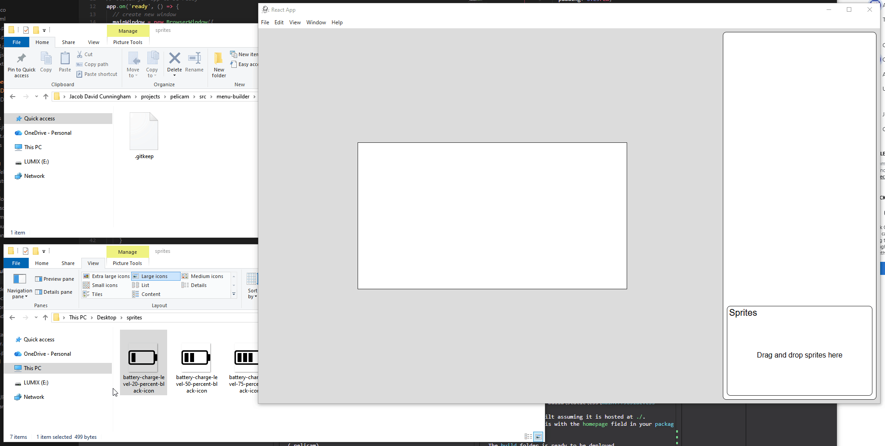
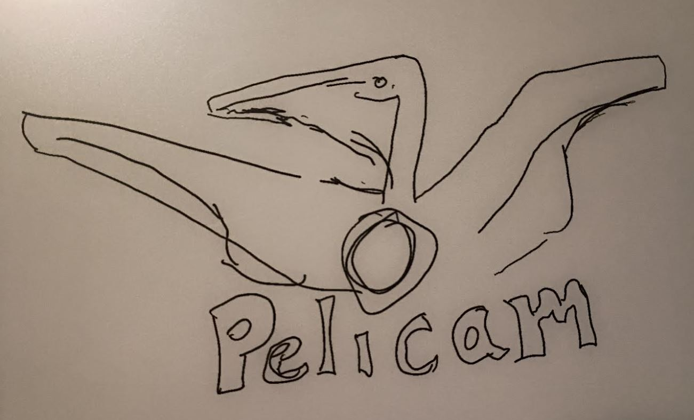
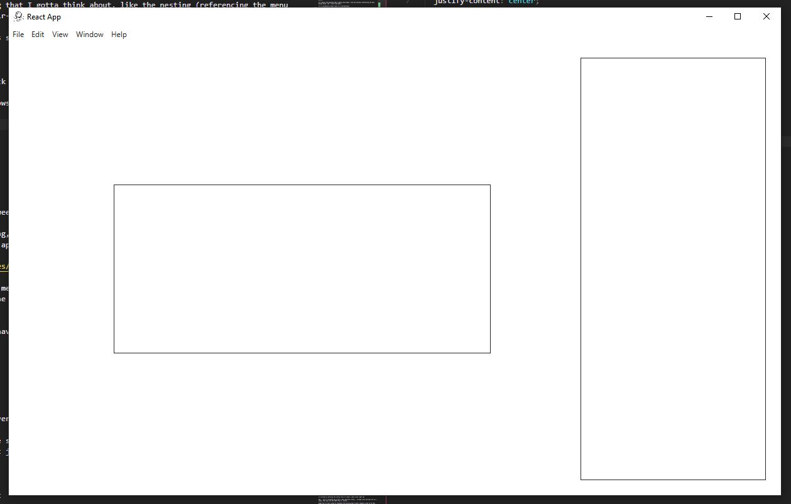
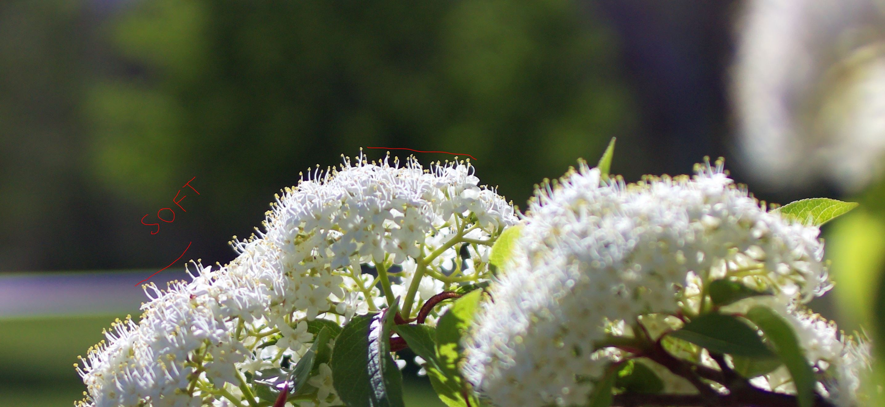
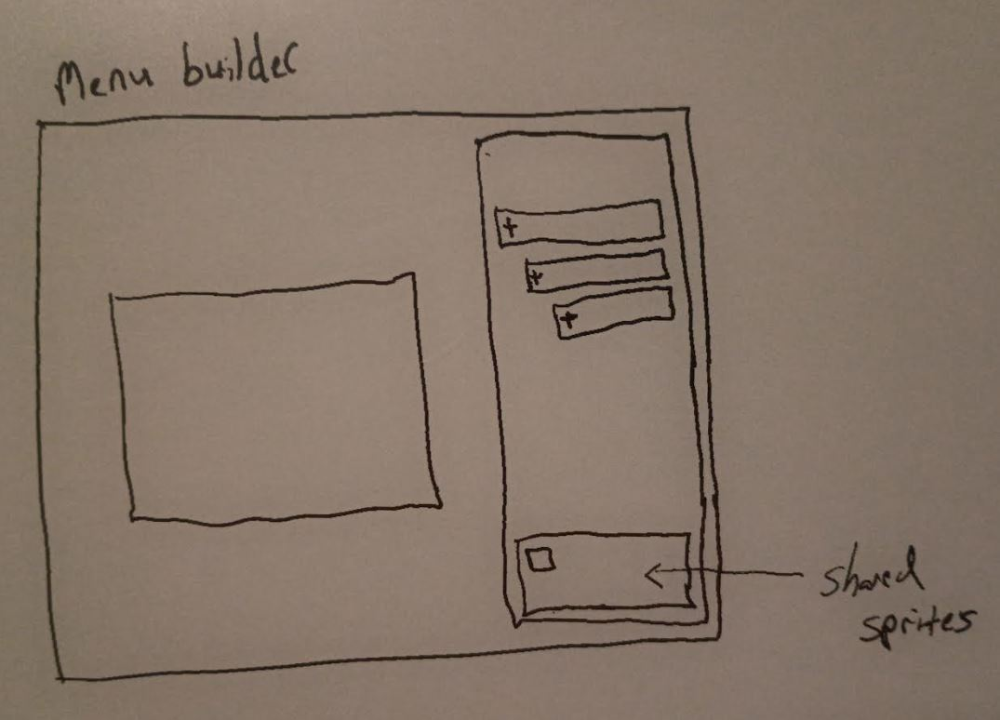
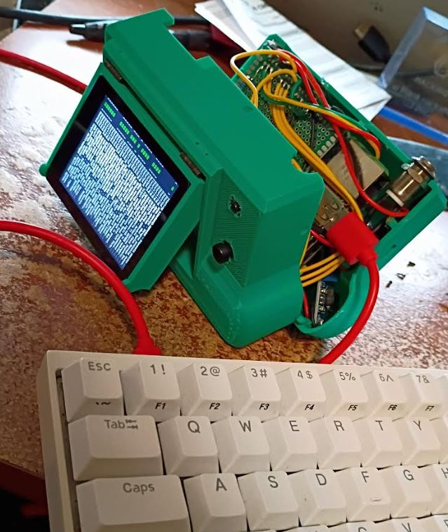
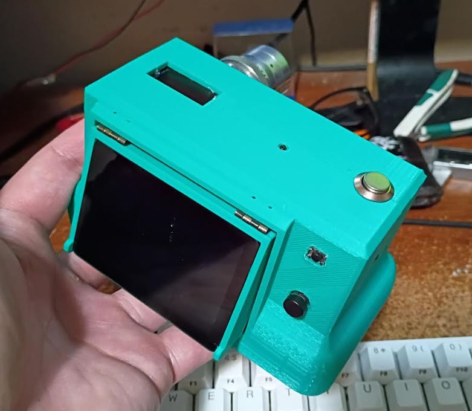
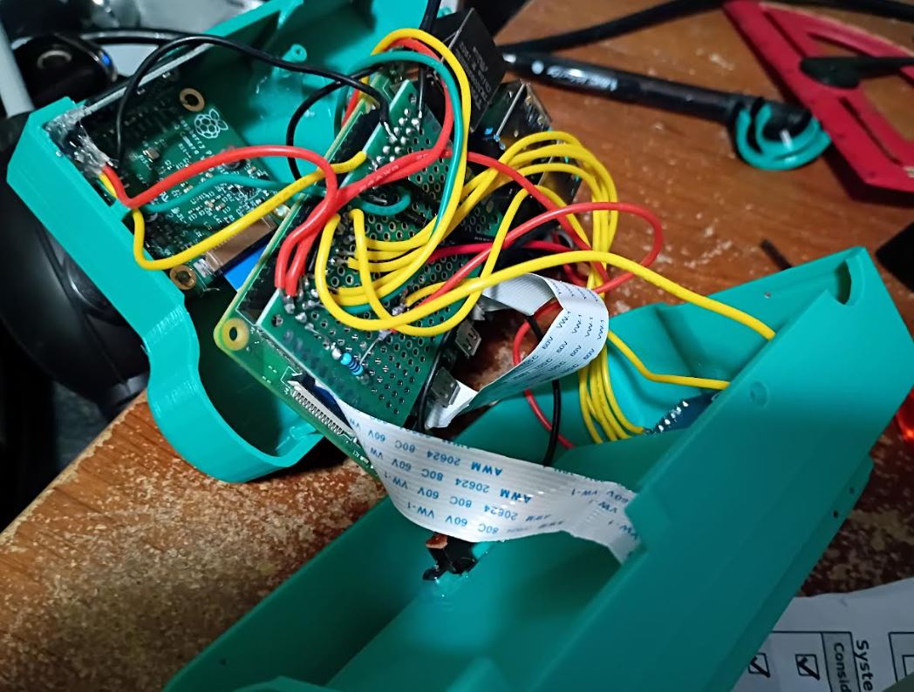
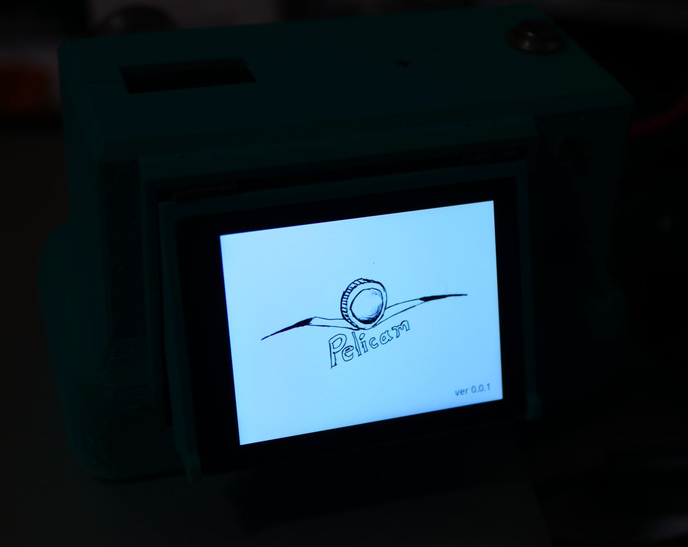
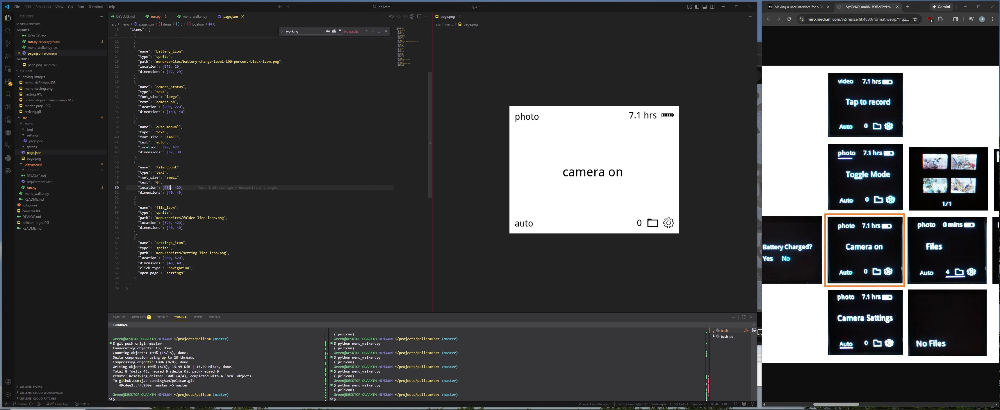

- [x] PC dev menu
  - this would be an OpenCV window
    - [x] keyboard interface (d-pad, enter, backspace, button for shutter like p I guess)
- [x] folder, file, config, structure
- [ ] make menu builder desktop app
- [ ] make all menu scenes from current menu
- [ ] walker
- [ ] functional-rendering
- [x] splash screen (logo)
- [x] battery charged
- [ ] home
  - [x] base scene
  - [ ] camera settings (need to figure out layout)
    - shutter
    - exposure
    - f-stop
      - detect electronic aperture if not manual (no value)
    - white balance
  - [ ] toggle mode
    - [ ] tap to record
  - [ ] files
    - [ ] file view (this one is interesting, where do the preview images come from)
    - [ ] no files
  - [ ] settings
    - [ ] settings page
      - [ ] raw telemetry (what is this for)
      - [ ] battery profiler
        - [ ] profiling battery
      - [ ] reset battery
      - [ ] timelapse
        - timelapse page
      - [ ] transfer to USB (hasn't worked lately even FAT32 format)
      - [ ] delete all files

- [ ] menu builder
  - [x] verify Electron can write to host
  - [ ] poc of drag-drop using react-dnd
  - [ ] save image from html
  - [ ] build out interface

### 01/28/2026

6:36 PM

I am here, I am present

Hiaksimaru

Don't let your dreams be memes

I'm aiming to have a functional camera by end of this weekend, means this menu builder is at a "finished" point and I actually develop the 1:1 feature parity menu that the modular pi cam has and I will add that laplace variance focus peaking.

There will be the rough functional build of the menu then the nice features for example what I'm going to work on write now is the sprite part where you drag-drop the sprite into the box and it shows up there as an availabe sprite to use.

- [ ] drag-drop feature on sprites (non-positional)
  - [x] drag-drop image saves to filesystem
  - [ ] advanced feature show toggle to show icons vs. list
- [ ] save menu page with html2canvas

6:42 PM

I've built a drag-drop image to base64 thing before see [here](https://github.com/jdc-cunningham/freelancer-journal/blob/master/react-app/src/components/right-body/RightBody.js)

I just gotta remember how it works

7:19 PM

Referencing this for the React to Electron bridge

https://wykrhm.medium.com/creating-standalone-desktop-applications-with-react-electron-and-sqlite3-269dbb310aee

I remember doing this for something I've made before

7:44 PM

Damn that was good... works

Now I need to make sure the actual files sync with the react side but this is great.

One hard thing down

I do need that reply turns out

8:10 PM

This is a pretty cool demo, you see me drag the file from a folder into another folder lol

But yeah this shows that I can genarate menus, assuming the html2canvas part works which it should, I did a lot of html to canvas/pdf stuff in 2021 damn... RIP that startup.

I'm feeling pretty drained already but I think I'll at least add that file name regex check tonight

It should use underscores in consideration of python although it would be a string so technically doesn't matter but looks neater.

---

### 01/27/2026

7:17 PM

Alright let me try and prototype this Electron app real quick, I need to make sure I can write to the file system. The plan is to output directly into the menu folder.

7:51 PM

My bad I got sidetracked but found a cool song Take Five by Filo the slow version with his kid

8:12 PM

So far it's looking good, I was able to save to the app directory and I just need to do screenshot to file which seems possible with html2canvas

8:24 PM

There are some things I'm instill unsure on, I mean I'm going to port all of the existing functionality from [modular-pi-cam's software](https://github.com/jdc-cunningham/modular-pi-cam/tree/master/cameras/pi-zero/large-display/software) but the menu icon binding to service/hardware calls kind of thing.

8:31 PM

I also don't know how to handle the hand off between OpenCV and raw image rendering for the SPI displays. I would think for the SPI case you're not going to use OpenCV in there at all... but maybe.

I came up with a new logo too, it shows the outline of a Pelican with the dot on the i being a lense... what's bad is it vaguely resembles the Golden Eagle and yeah... don't want to do that.

There's too much going on anyway so may just stick to the simple Pelicam with the dot of the i being a lens... this is dumb stuff need the working code first.

8:43 PM

So the sprites get drag-dropped into the app and they get written to the host. I could turn them into base64/hold em in memory but I think it makes sense to actually store them.

Then you can drag the sprite and drop it onto the page.

8:49 PM

I think today I can get the basic skeleton done of the desktop app.

Once I prove out the key parts, the rest is easy coding for me as I'm primarily web dev although lately I've been working in the cloud eg. writing Cloudformation templates but I have a heavy background in Python as well, as all of our AI-related source code is written in python.

It's mostly the planning that I gotta think about, like the nesting (referencing the menu design below, the + stair-step deal).

If it conceptually makes sense to a non-developer.

10:17 PM

Let me do this real quick screenshot for the gram

This is not much but shows clear progress

I'll add the top-bottom part of the right panel, with the snippets portion having drag-drop on it to add sprites.

Have to make the left side have fixed/dynamic sizing where you enter the display dimensions and then it's snappable with react-dnd

I'd probably put the title of the menu scene above the menu display as you click through the items on the right.

10:30 PM

I really want to get good, sharp pictures in the future

This high resolution display and extra compute (during passthrough) will come in handy

At the very least a crude implementation of focus peaking using the laplace variance and display a number that increases/decreases depending on how blurry or focused the scene is

I use my own photos for my ultrawide desktop display wallpaper, I hide all the icons so it's just a huge image and I do use the photos taken by the RPi HQ Cam, I used to Sony Alpha A7II and A7R3 and I have you know "perfect" pictures from those because of the full frame sensor, 42MP and big lenses...

If you see below, this is an RPi HQ cam image I took and I could have gotten this to be shaper if I had a higher resolution display or the focus checking algorithm running

---

### 01/26/2026

5:07 PM

Yeah... I did waste my weekend but I'll get better with productivity

This is what I'm thinking, if I can prove out that Electron can write to file system then I will write this desktop app with ReactJS.

You would specifiy your menu size, it shows a window. Then you can start adding depth/sprites and positioning them. The end result is it generates JSON files that define each menu and the linked pages/functions.

The functions part I'd have to look into.

---

### 01/24/2026

3:32 PM

I am unfortunately recovering from a hangover but I'll get something done today

I'm gonna 3D print those small correction pieces for the camera like the OLED gap and the broken screw holder that joins the two body shell parts together

10:02 PM

Redemption, I am present

Let's do some work

I'm really tempted to write that menu builder... the issue is you're dealing with writing to file system which the web can't do

So I'd have to make a desktop app that can access the file system/write to it

I'm not actually gonna be able to do anything hard right now, I'm already lit (but moderately lit)

This camera body is really growing on me though, it's cool, it's green

10:55 AM

I am going to design another menu where it's cyberpunk looking just to show you that you can literally make any menu style you want, it's a screen and better than SPI in terms of refresh rate

---

### 01/23/2026

Alright so I had to use `sudo raspi-config` to connect to my wifi for some reason even though I had set it when writing the raspbian image to the SD card

Anyway got past that and it was straight forward to have systemd run the `xinit ./openbox` command so now that's running on boot, although it will be disabled until it's done

I literally had to plug in a keyboard to the camera to connect the wifi as mentioned above

6:51 PM

There's gonna be a big snow storm this weekend, I'm going nowhere!

I'm gonnna bust this menu out.

---

### 01/22/2026

12:16 AM

well... unfortunately that's it for today

I need to zip tie the charger down as the heat made the charger unglue itself and now I can't plug the micro usb in lmao... ugh

10:42 PM

Well I was gonna try and bust out the quick short where it boots into pelicam but for some reason.... MF fuck... it won't show an IP address so I can't ssh into it

So I'm gonna have to take it apart and plug a keyboard into it I guess

Why tf... I keep running into dumb ass problems

But today was a good day, hung out with some people played indoor golf

I did address the charging problem, I unfortunately just hot glued the f out of it, which it's funny, you have to wait for it to cool off for the hot glue to hold, because the charger gets hot enough to re-melt the hot glue

---

### 01/21/2026

7:08 PM

Alright so at this point I've got a fully assembled camera, pretty rad, but it needs a menu

I need to go and make some updates to the STL files real quick as they were broken.

Well what I want to get done real quick is have an auto-boot script that loads the GUI and it shows pelicam on the screen

7:14 PM

I also want to time how long it takes to boot

7:30 PM

I had to do a bunch of cleaning, kind of spacing out

- systemd boot script
- load image in opencv

7:54 PM

Getting mixed up, so oddly I have this problem of "Failed to open display from the DISPLAY environment variable"

I also was setting systemd wrong, forgetting it has to run openbox

8:07 PM

Help me step code I'm stuck

For some reason I can't open the display

8:24 PM

It looks like my boot is corrupted actually, it hangs on this "raspberry pi completed socket interaction for boot stage final" message

Lead me to this

https://forums.raspberrypi.com/viewtopic.php?t=134454

adding the empty `cloud-init.disabled` file to `/etc/cloud` and reboot

This seems to have worked, I now see a `raspberry login: _`

8:26 PM

Still unable to open display damn

I might just nuke it and start over so I can fully document the steps

8:33 PM

This is weird... I guess I have to run `startx` and then it opens a window... but then you can only use this window... odd

I don't remember doing this before... I would wipe this pi but I have to take the camera apart lmao

8:42 PM

ugh... damnnnnnnn this is brutal

I'm gonna wipe the pi, I have to take it apart lmao

8:51 PM

Ugh... so sad, I have to start over from scratch, reeeeeeeeeeeeeee

9:05 PM

I have to cook and eat food but it's reflashed...

First thing you have to do is do the DT overlay stuff to get the screen to work

Oh man.... I forgot about all those steps I did reeee

I'm gonna log this stuff in a dedicated file

10:02 PM

There is one thing I did not do which is to get a current draw for the system.

The Pi 4B is a hungry boy as it idles at 500mA apparently and that's without the camera running and not factoring in the display.

So it's possible it uses like 1A peak which means this 3400 mAh battery or whatever will only last say 2-3 hrs vs. 6-7 on the pi zero 2w

I thought of it because it just died and I wasn't sure if it was on or not (pi is inside lol and no display out yet)

10:29 PM

Nooooo the pi doesn't have enough power keeps rebooting mid command lol

10:43 PM

Alright I'm gonna have to let it charge for a while, it's not able to keep up while plugged into the 1A charger

11:09 PM

Booted it back up, got past last install command I was running

11:15 PM

wtf is this... complaining about evdev

11:21 PM

Damn... failed to open display message again lol

Ohhhh damn... I had to refer back to the openbox post

You use `xinit` to launch the script

https://forums.raspberrypi.com/viewtopic.php?t=152264

11:37 PM

This is so weird, I don't know why I can't reproduce this menu opening thing, it was the first thing I did

omg it's a bash script so have to use the `./openbox`

oof

It's actually a good thing I had to do this over from scratch, there are so many steps I figured out but didn't write down

11:48 PM

Yeah another one, have to put python in the top of the file

11:52 PM

Finally...

This display is so crisp holy shit...

Now I gotta tie it to a startup mechanism

11:59 PM

Damn it just died... this display must use a lot of power damn

---

### 01/16/2026

5:44 PM

One thing I was thinking about is shooting in RAW. I really want to maximize the image I can get out of this thing. I'm a noob photographer so I primarily shoot in auto.

But I've seen RAW images other people have taken and corrected with this sensor and they're pretty good, granted they are large objects, not things like leaves which look bad so far on this sensor.

---

### 01/12/2026

7:38 PM

Gonna work on some menus, I feel spent

I got to take out the Vivitar 75-200mm which is super telephoto with this 5.5 crop, that was pretty fun though the vibration/no stabilization meant a lot of bad pictures and video

8:40 PM

One thing I have to figure out right away is loading this menu in OpenCV and then traversing through the menu state, that's a core functionality, the rest is just work

---

### 01/11/2026

3:33 PM

Alright... I think I have a hangover, feel like crap

I did workout, just ate a big meal (have to cook the potatoes before they go bad)

I am kind of losing momentum on this project but I will complete it

Just the waiting between the 9-5 job and the weekend

Going out and doing photography was fun, I went near the city and put a couple videos up on the Vanta Wing YouTube channel

Let's see... I have at least 16 scenes to make to replicate the current menu

3:56 PM

Starting now, the other thing I was thinking about, the camera pass through will have overlaid text on it, the video has it already for recording and elapsed time

Camera stream will be faked on desktop with a static image, it could do a loop if you really wanted to, set an array somewhere and count... that would make it more convincing

4:09 PM

I'm really tempted to make that menu maker, it would be web based and spits out the JSON

I think one of the hard things is the snapping/you'd need a grid thing but really it's not bad

It's just one of those things, the time to make it, takes as long to manually write these out... but I think it will be a necessity at some point because writing JSON files manually to describe each menu page is pretty brutal

4:24 PM

Yeah that menu designer thing will have to be made as it would account for things like outer padding (20px right now) and space between things

4:29 PM

Damn... 1 down

4:31 PM

This is what my screen looks like as I make these menu scenes

It'll be great to see this rendered on the actual DSI display

4:43 PM

What will be interesting too is how to handle extra displays like the camera I'm currently designing has the main 2.8" DSI display and a 0.91" thin rectangle OLED

5:15 PM

It's crazy what you can make... I was thinking the top display could be a little animated thing... like the camera is alive

Idk I like the Skippy gun from the game Cyberpunk 2077.

Yeah thinking about a cyberpunk style menu would be neat too...

I'm already thinking of another to design/make, it's ESP32 based which I know not high megapixel count but the thing is it's designed to be like a card and the lens is on the top-right (facing you).

Today is unfortunately wasted, I feel tired/not into anything.

I'll keep plugging away at this though with the menu screens as I still have to port over the camera software itself

---

### 01/07/2026

6:26 PM
Alright just came back from the gym did my half hour of inclined walking
This little fatty trying to lose that gut, I've bulked up from the lifting but still a chubby

Going to setup a "playground" where you can run the OpenCV with specific bound buttons and it'll also traverse a menu/render it for testing

7:26 PM
Damn... struggle bus

But I've got an OpenCV GUI with keys listening and clicks
Now I can do a prototype of the menu tree rendering and traverse it (active box)

7:38 PM

I'm working on defining the config files to render a menu scene right now

Ugh... now I'm thinking you'd want a menu generator thing... arrange icons and what not on a scene, then spit out the JSON from it, future...

Right now I'm just trying to reproduce the existing menu to get a handle on how to do this

I'm using MS Paint to get a rough position, the menu was designed to be a square so it'll get moved around

The thing is I'll start adding things like shutter speed, exposure, AWB, etc... on the menu as well

I'll first render one page and then work on adding more/doing the walking then state management

7:52 PM

I'll source icons from UX Wing 64px looks like a good size for sprites

7:55 PM

The way I think the walker will work, when you first boot the camera, it pre-renders all of the menu pages as is. Then depending on the camera state, certain values are filled in on the fly like an updating battery hours left indicator for example.

First menu I'm working on is black text/icons on white

Unfortunately automatic dynamic menu scaling is not considered right now, where you specify the base menu system and scale it up or down, it's easy to do if it's a square but if you go to rectangle or circle then the coordinates don't match

It could be CSS-based lol

8:03 PM

The sprites folder will be flat I decided since some may be re-used

This is where it starts to get challenging.

So settings for example, it says `click_type` is navigation, and it specifies where it goes with `open_page`

I feel like they have to be chained right... like dot notation

So the folders in the menu folder are like keys to an object.

So accessing "settings" is just "settings" but if settings had a subpage then it would be `settings.sub_page`

8:10 PM
Oh... it can also just literally have "page_name"

8:29 PM

I feel like this makes sense?...

You preload the images, they're stored in memory and when you need to update them you just overwrite them while the camera is running.

Oh... the one problem is you would have to re-render the entire page because of left over text being stacked imagine going from long to short text... or you paste the area over the original image but probably easier to just re-render the entire page.

I need to see the passthrough but I'm still waiting for the HQ cam I ordered

I think this was decent progress, let me do the looper that renders the menu not the walker, the walker I need to look at more, referencing this:

https://stackoverflow.com/a/20199213

8:40 PM

Alright that's not quite right but working

8:53 PM

Hey this is pretty cool, I'm reducing the sizes of the icons and regenerating the menu image

---

### 01/06/2026

7:30 PM
Damn I'm so tired, eyes hurt... funny too I left my clothes at the gym, I was like wtf did I forget

---

### 01/04/2026

9:08 PM

I'm mentally drained at this point but I did put out a video

I still gotta actually write the menu walker

I've had some thoughts come up already like how do I handle dynamic text with regard to menu state

It's one thing to produce the images but if you have dynamic text it's kind of pointless to make the image ahead of time

It might make more sense to just store it in memory and render it on the fly (taking into account "caching" where you don't repaint the screen unless something changed)

9:37 PM

one thing I was thinking about with the touch screen is a slider, that would be interesting to render, the PIL display process wouldn't work great, could be a standalone view but yeah... can just use arrow keys

For saving tuning/lens profiles I was thinking I'd need a split keyboard where you'd take a standard qwerty, cut it in half and just toggle to each side that you need the letter on

---

### 01/03/2026

12:04 AM

Yesterday I interfaced with the 2.8" DSI waveshare display which was new to me since it was not just showing an image straight up like with SPI displays

So after I figured out how to use a windowing system eg. x11 through openbox, that changed my idea of how this menu will work

This menu will just be a state machine pretty much where you specify a state and it outputs a menu

The top of the layer is the dimension/click coordinate and that feeds the state machine

---

### 01/02/2026

12:13 AM

You can see in this menu-map for the Pi Zero HQ Cam the number of screens

Will reproduce that but through the nested folder/files instead of this [POS](https://github.com/jdc-cunningham/pi-zero-hq-cam/blob/master/camera/software/menu/menu.py) that I made

Will be interesting on first boot to check for changes, you'd have to remove the flattened menu image to generate a new one based on specified icon image files and location

That popup question about battery being charged though... which is based on an "on-ticker" eg. counting up as it's booted.

I'm not sure how to define that yet in the menu. Maybe same depth but you don't say "root/index" or something.

or a separate folder

---

### 01/01/2026

10:04 PM

Tomorrow's gonna be brutal, I gotta be back at work 9-5 although I'm working from home but lately I've been getting up at 3-4 PM.

I'm gonna do some work on this since I'm starting to design/build the other camera. Shame on me for jumping projects!

But at least now I'm driven again and I started buying parts. I got a nice cash gift from a friend so I bought a lot of stuff.

Pull out the ol MS paint.

The nice thing is I can do the menu work outside of an RPi. Also with the full sized RPi you can mount it and work against it in VS Code.

We're just using python PIL to flatten images together eg. icons on top of a background.

The lens scaling is the other problem which I don't know if you can fully solve due to the icons themselves unless you scale it but yeah... then there's the square vs. rectangle problem

As you can see below I've been thinking of using nested folder routing like web app routing.

Also I think the state of the menu will be a 1D array where each value is a depth and position/coordinate.

The folders are recursively traversed to build the menu and bind all the functions to the hardware

10:23 PM

I should be able to reproduce the current menu that [modular-pi-cam](https://github.com/jdc-cunningham/modular-pi-cam) and [pi-zero-hq-cam](https://github.com/jdc-cunningham/pi-zero-hq-cam) are using.

---

### 12/23/2025

I've been thinking about this more

I had this thought of a nested folder/file system to declare menus

There would be a config file, a folder for images, then you'd have another folder to go deeper

The icons would have a coordinate map, it would be proportional so it could hopefully adapt to different screen sizes

Functions to call when the icon is clicked

---

### 12/16/2025

9:01 PM

I have some of my cameras on my desk at my job and I was looking at them.

Made me think of JSON you know, how nice it is to just nest things and have a structure.

I think that's how I want the menus to be defined, nested pages for the state management.

I'm going to work on this again probably near spring just so I can get out and explore, be with nature

I also want to source a better screen, like a touch screen-primaly camera with a 5D button and shutter, possibly dedicated back button
