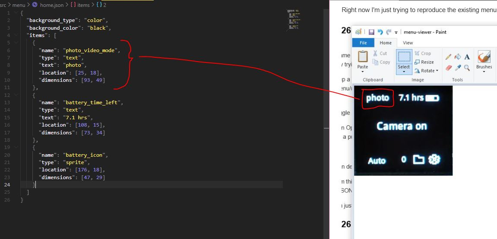
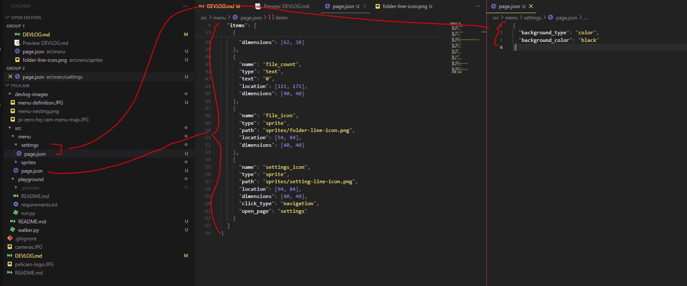
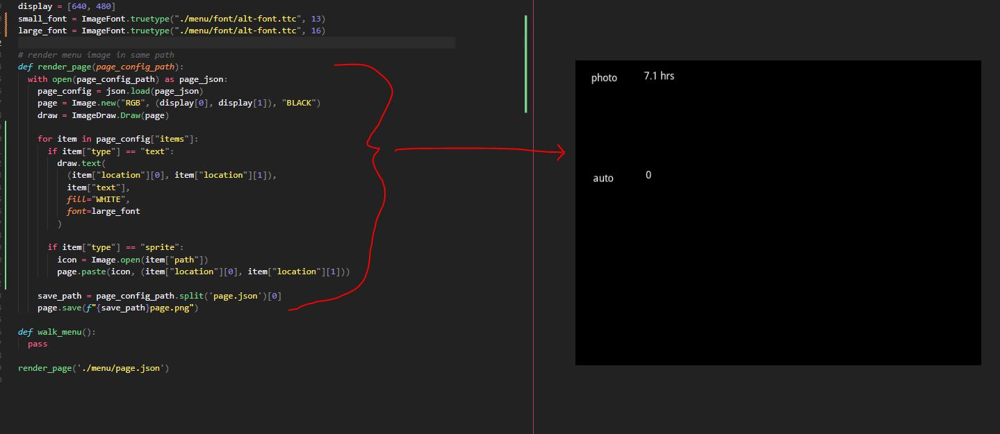
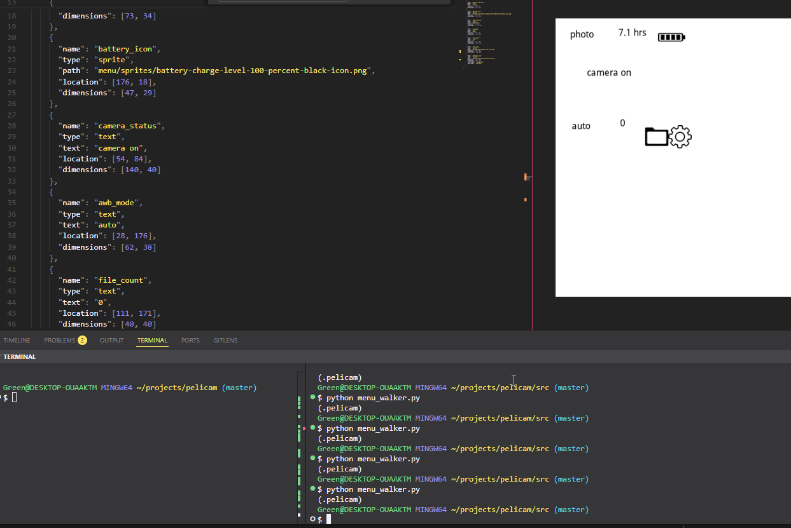
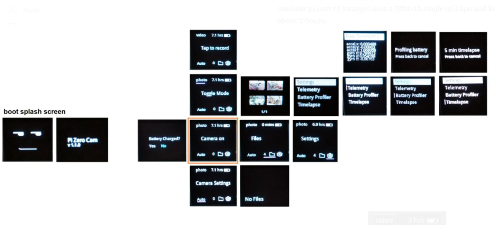
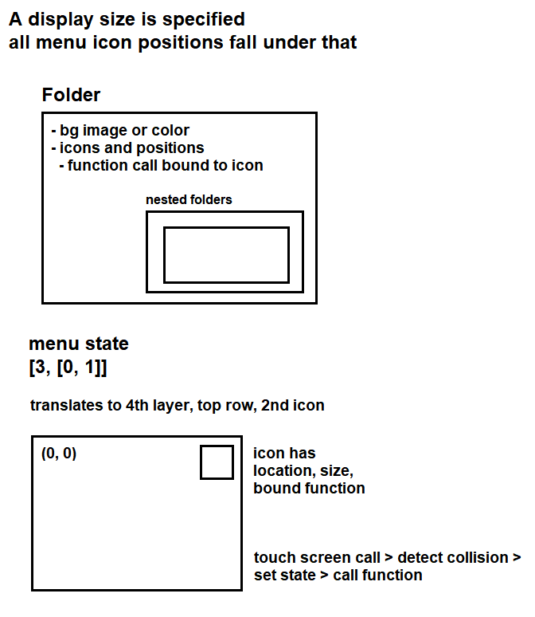

- [x] PC dev menu
  - this would be an OpenCV window
    - [x] keyboard interface (d-pad, enter, backspace, button for shutter like p I guess)
- [x] folder, file, config, structure
- [ ] make all menu scenes from current menu
- [ ] walker
- [ ] functional-rendering

### 01/11/2026

- [ ] splash screen
- [ ] battery charged
- [ ] home
  - [x] camera settings
  - [ ] toggle mode
    - [ ] tap to record
  - [ ] files
    - [ ] file view (this one is interesting, where do the preview images come from)
    - [ ] no files
  - [ ] settings
    - [ ] settings page
      - [ ] raw telemetry (what is this for)
      - [ ] battery profiler
        - [ ] profiling battery
      - [ ] reset battery
      - [ ] timelapse
        - timelapse page
      - [ ] transfer to USB (hasn't worked lately even FAT32 format)
      - [ ] delete all files

3:33 PM

Alright... I think I have a hangover, feel like crap

I did workout, just ate a big meal (have to cook the potatoes before they go bad)

I am kind of losing momentum on this project but I will complete it

Just the waiting between the 9-5 job and the weekend

Going out and doing photography was fun, I went near the city and put a couple videos up on the Vanta Wing YouTube channel

Let's see... I have at least 16 scenes to make to replicate the current menu

3:56 PM

Starting now, the other thing I was thinking about, the camera pass through will have overlaid text on it, the video has it already for recording and elapsed time

Camera stream will be faked on desktop with a static image, it could do a loop if you really wanted to, set an array somewhere and count... that would make it more convincing

4:09 PM

I'm really tempted to make that menu maker, it would be web based and spits out the JSON

I think one of the hard things is the snapping/you'd need a grid thing but really it's not bad

It's just one of those things, the time to make it, takes as long to manually write these out... but I think it will be a necessity at some point because writing JSON files manually to describe each menu page is pretty brutal

4:24 PM

Yeah that menu designer thing will have to be made as it would account for things like outer padding (20px right now) and space between things

4:29 PM

Damn... 1 down

---

### 01/07/2026

6:26 PM
Alright just came back from the gym did my half hour of inclined walking
This little fatty trying to lose that gut, I've bulked up from the lifting but still a chubby

Going to setup a "playground" where you can run the OpenCV with specific bound buttons and it'll also traverse a menu/render it for testing

7:26 PM
Damn... struggle bus

But I've got an OpenCV GUI with keys listening and clicks
Now I can do a prototype of the menu tree rendering and traverse it (active box)

7:38 PM

I'm working on defining the config files to render a menu scene right now

Ugh... now I'm thinking you'd want a menu generator thing... arrange icons and what not on a scene, then spit out the JSON from it, future...

Right now I'm just trying to reproduce the existing menu to get a handle on how to do this

I'm using MS Paint to get a rough position, the menu was designed to be a square so it'll get moved around

The thing is I'll start adding things like shutter speed, exposure, AWB, etc... on the menu as well

I'll first render one page and then work on adding more/doing the walking then state management

7:52 PM

I'll source icons from UX Wing 64px looks like a good size for sprites

7:55 PM

The way I think the walker will work, when you first boot the camera, it pre-renders all of the menu pages as is. Then depending on the camera state, certain values are filled in on the fly like an updating battery hours left indicator for example.

First menu I'm working on is black text/icons on white

Unfortunately automatic dynamic menu scaling is not considered right now, where you specify the base menu system and scale it up or down, it's easy to do if it's a square but if you go to rectangle or circle then the coordinates don't match

It could be CSS-based lol

8:03 PM

The sprites folder will be flat I decided since some may be re-used

This is where it starts to get challenging.

So settings for example, it says `click_type` is navigation, and it specifies where it goes with `open_page`

I feel like they have to be chained right... like dot notation

So the folders in the menu folder are like keys to an object.

So accessing "settings" is just "settings" but if settings had a subpage then it would be `settings.sub_page`

8:10 PM
Oh... it can also just literally have "page_name"

8:29 PM

I feel like this makes sense?...

You preload the images, they're stored in memory and when you need to update them you just overwrite them while the camera is running.

Oh... the one problem is you would have to re-render the entire page because of left over text being stacked imagine going from long to short text... or you paste the area over the original image but probably easier to just re-render the entire page.

I need to see the passthrough but I'm still waiting for the HQ cam I ordered

I think this was decent progress, let me do the looper that renders the menu not the walker, the walker I need to look at more, referencing this:

https://stackoverflow.com/a/20199213

8:40 PM

Alright that's not quite right but working

8:53 PM

Hey this is pretty cool, I'm reducing the sizes of the icons and regenerating the menu image

---

### 01/06/2026

7:30 PM
Damn I'm so tired, eyes hurt... funny too I left my clothes at the gym, I was like wtf did I forget

---

### 01/04/2026

9:08 PM

I'm mentally drained at this point but I did put out a video

I still gotta actually write the menu walker

I've had some thoughts come up already like how do I handle dynamic text with regard to menu state

It's one thing to produce the images but if you have dynamic text it's kind of pointless to make the image ahead of time

It might make more sense to just store it in memory and render it on the fly (taking into account "caching" where you don't repaint the screen unless something changed)

9:37 PM

one thing I was thinking about with the touch screen is a slider, that would be interesting to render, the PIL display process wouldn't work great, could be a standalone view but yeah... can just use arrow keys

For saving tuning/lens profiles I was thinking I'd need a split keyboard where you'd take a standard qwerty, cut it in half and just toggle to each side that you need the letter on

---

### 01/03/2026

12:04 AM

Yesterday I interfaced with the 2.8" DSI waveshare display which was new to me since it was not just showing an image straight up like with SPI displays

So after I figured out how to use a windowing system eg. x11 through openbox, that changed my idea of how this menu will work

This menu will just be a state machine pretty much where you specify a state and it outputs a menu

The top of the layer is the dimension/click coordinate and that feeds the state machine

---

### 01/02/2026

12:13 AM

You can see in this menu-map for the Pi Zero HQ Cam the number of screens

Will reproduce that but through the nested folder/files instead of this [POS](https://github.com/jdc-cunningham/pi-zero-hq-cam/blob/master/camera/software/menu/menu.py) that I made

Will be interesting on first boot to check for changes, you'd have to remove the flattened menu image to generate a new one based on specified icon image files and location

That popup question about battery being charged though... which is based on an "on-ticker" eg. counting up as it's booted.

I'm not sure how to define that yet in the menu. Maybe same depth but you don't say "root/index" or something.

or a separate folder

---

### 01/01/2026

10:04 PM

Tomorrow's gonna be brutal, I gotta be back at work 9-5 although I'm working from home but lately I've been getting up at 3-4 PM.

I'm gonna do some work on this since I'm starting to design/build the other camera. Shame on me for jumping projects!

But at least now I'm driven again and I started buying parts. I got a nice cash gift from a friend so I bought a lot of stuff.

Pull out the ol MS paint.

The nice thing is I can do the menu work outside of an RPi. Also with the full sized RPi you can mount it and work against it in VS Code.

We're just using python PIL to flatten images together eg. icons on top of a background.

The lens scaling is the other problem which I don't know if you can fully solve due to the icons themselves unless you scale it but yeah... then there's the square vs. rectangle problem

As you can see below I've been thinking of using nested folder routing like web app routing.

Also I think the state of the menu will be a 1D array where each value is a depth and position/coordinate.

The folders are recursively traversed to build the menu and bind all the functions to the hardware

10:23 PM

I should be able to reproduce the current menu that [modular-pi-cam](https://github.com/jdc-cunningham/modular-pi-cam) and [pi-zero-hq-cam](https://github.com/jdc-cunningham/pi-zero-hq-cam) are using.

---

### 12/23/2025

I've been thinking about this more

I had this thought of a nested folder/file system to declare menus

There would be a config file, a folder for images, then you'd have another folder to go deeper

The icons would have a coordinate map, it would be proportional so it could hopefully adapt to different screen sizes

Functions to call when the icon is clicked

---

### 12/16/2025

9:01 PM

I have some of my cameras on my desk at my job and I was looking at them.

Made me think of JSON you know, how nice it is to just nest things and have a structure.

I think that's how I want the menus to be defined, nested pages for the state management.

I'm going to work on this again probably near spring just so I can get out and explore, be with nature

I also want to source a better screen, like a touch screen-primaly camera with a 5D button and shutter, possibly dedicated back button
