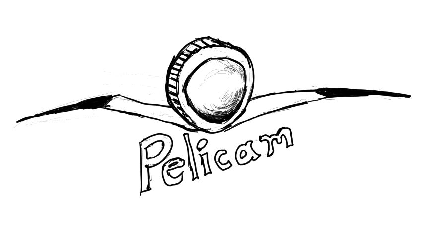
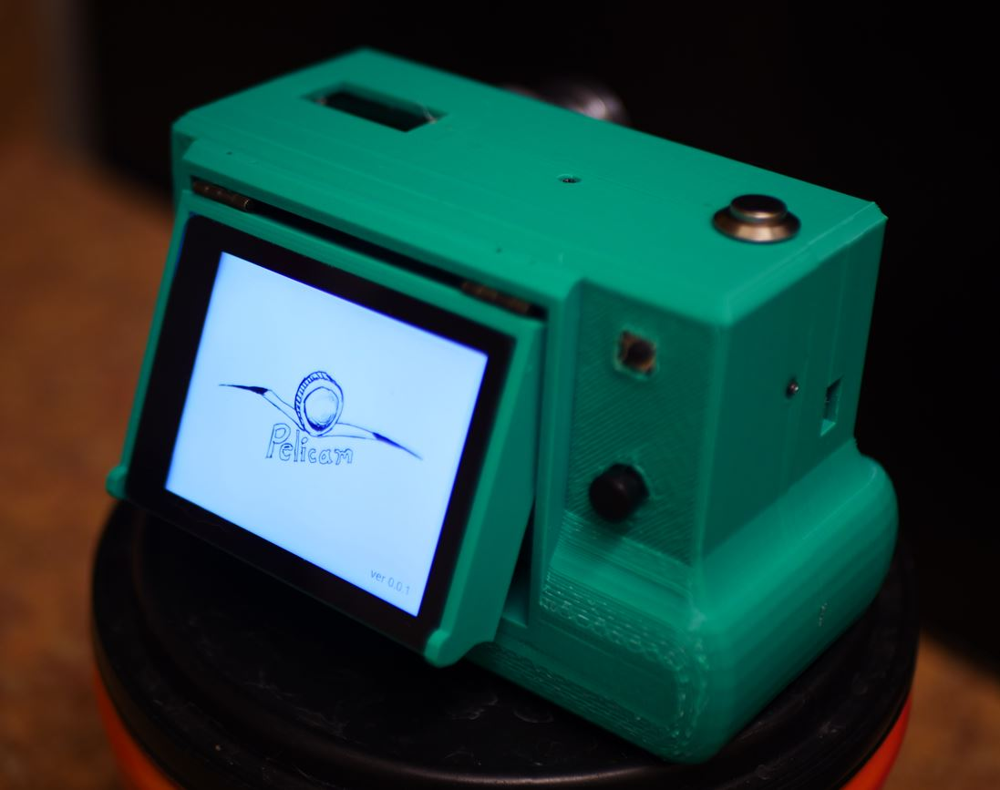
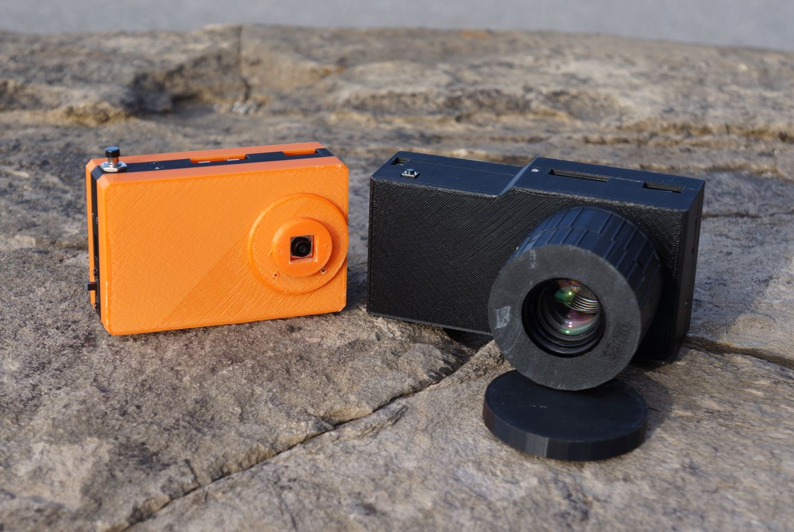

### Pelicam

Software for DIY handheld cameras specifically using the Raspberry Pi ecosystem (boards and camera modules).

This software factors in display type eg. SPI or DSI

([modular](https://github.com/jdc-cunningham/modular-pi-cam) and [pi zero hq cam](https://github.com/jdc-cunningham/pi-zero-hq-cam))

### Supported hardware

#### boards

- Full-sized Raspberry Pi's eg. Pi 4B
- Pi Zero 2 (preferred for SPI refresh rate)

#### cameras

- v1 5MP
- v2 8MP
- v3 12MP (wide and narrow)
- HQ 12.3MP

#### Operating systems

- raspbian lite preferred
  - bookworm for AP web controller, also boots faster

#### Interfaces

- tactile currently