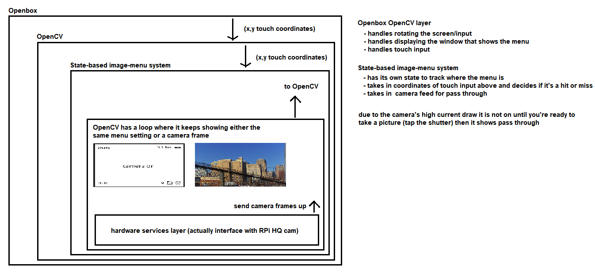

# Pelicam

This source code has 3 parts:
- a menu builder (desktop app)
- the menu output from the builder eg. pages of a menu defined in JSON
- the playground which allows you to run the menu outside of the camera

## How the software runs on the camera

You have to specify what type of display your display is eg. is it DSI (flat cable) or SPI, this determines how the menu is rendered on your camera. DSI uses a GUI wrapper around the menu and SPI displays images as fast as the RPi/SPI display can render it.

There are up to 3-layers depending on what environment the menu is running in:

- PC (2)
  - OpenCV GUI
  - rendered menu
- hardware eg. a camera (3)
  - Openbox window manager
  - OpenCV GUI
  - rendered menu

The layers aren't really important. Openbox you just run it... doesn't really do much. OpenCV is what shows the menu on the screen. It sits above the actual camera menu/software. It allows you to take camera frames and either show them for a real-time passthrough or apply an algorithm on the image eg. laplace variance for focus checking.

## Sprites

These are sourced from uxwing but in general you just need PNGs.
